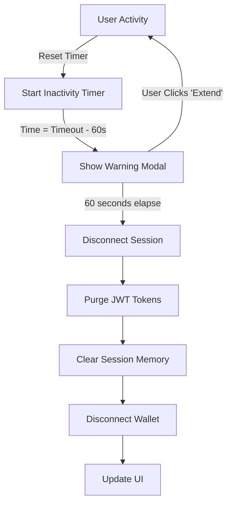

# Auto-Lock Security Timer

**Version:** 1.0.0  
**Last Updated:** September 24, 2026  
**Status:** ✅ Production Ready

## Overview

The Auto-Lock Security Timer automatically disconnects inactive wallet sessions after configurable timeout periods to protect user funds and sensitive data on shared or public terminals. The system combines inactivity detection, configurable timeouts, warning modals, and comprehensive session cleanup.

## Features

### 🔐 Core Security
- **Activity Detection**: Monitors mouse movement, keyboard input, mouse clicks, and touch events
- **Configurable Timeouts**: 15 minutes, 30 minutes, 1 hour, or Never
- **60-Second Warning**: Modal countdown with session extension option
- **Automatic Cleanup**: Purges JWT tokens and sensitive session data
- **Persistent Preferences**: User settings saved to localStorage

### 🎯 User Experience
- **Visual Countdown**: Real-time countdown display with progress bar
- **Extend Session**: One-click session extension during warning phase
- **Status Indicators**: Live feedback on auto-lock configuration
- **Accessibility**: Full ARIA labels and keyboard navigation support

### 🛡️ Security Measures
- **JWT Token Purging**: Automatic removal of authentication tokens
- **Session Memory Cleanup**: Clears sensitive data from all storage locations
- **Wallet Disconnect**: Integrates with WalletContext for complete logout
- **Cookie Cleanup**: Removes auth-related cookies on timeout

## Architecture

### Component Hierarchy

```
RootLayout
└── WalletSessionProvider (15-min base timeout)
    └── SessionTimeoutManager (Enhanced configurable timeout)
        └── ScreenLockProvider (PIN-based screen lock)
            └── Application Content
```

### Key Components

#### 1. **SessionTimeoutManager** (`src/components/security/SessionTimeoutManager.tsx`)
Main provider component managing timeout logic and warning modal.

**Responsibilities:**
- Activity event listeners (throttled)
- Timer management and countdown
- Warning modal display
- Token purging and session cleanup
- Integration with WalletContext

**Context API:**
```typescript
interface SessionTimeoutContextType {
  autoLockDuration: AutoLockDuration;
  setAutoLockDuration: (duration: AutoLockDuration) => void;
  resetTimer: () => void;
  isWarningActive: boolean;
  warningSecondsRemaining: number | null;
}
```

#### 2. **AutoLockSettings** (`src/components/security/AutoLockSettings.tsx`)
User interface for configuring timeout preferences.

**Features:**
- Radio button group for timeout selection
- Live status indicators
- Security warnings for "Never" option
- Real-time warning countdown display

#### 3. **WalletSessionProvider** (`src/context/WalletContext.tsx`)
Base wallet session provider with 15-minute fixed timeout.

**Integration Point:**
- Wraps WalletProvider with idle timeout logic
- Provides session purge functionality
- Exposes `useWalletSession()` hook

## Usage

### Basic Integration

The SessionTimeoutManager is automatically active for all authenticated users via the root layout. No additional setup required for basic functionality.

### Accessing Session Timeout Context

```typescript
import { useSessionTimeout } from '@/components/security/SessionTimeoutManager';

function MyComponent() {
  const {
    autoLockDuration,
    setAutoLockDuration,
    resetTimer,
    isWarningActive,
    warningSecondsRemaining
  } = useSessionTimeout();

  // Check current setting
  console.log(`Auto-lock: ${autoLockDuration} minutes`);

  // Reset timer after sensitive action
  const handleSignTransaction = async () => {
    await signTransaction();
    resetTimer(); // Restart inactivity timer
  };

  return (
    <button onClick={handleSignTransaction}>
      Sign Transaction
    </button>
  );
}
```

### Configuring Timeout Duration

Users can configure their preferred timeout via Settings page:

1. Navigate to **Settings** (`/settings`)
2. Locate **Auto-Lock Security** section
3. Select desired timeout duration:
   - **15 minutes**: Maximum security (shared computers)
   - **30 minutes**: Balanced (recommended)
   - **1 hour**: Extended sessions (private devices)
   - **Never**: Disabled (not recommended)

### Programmatic Configuration

```typescript
import { useSessionTimeout } from '@/components/security/SessionTimeoutManager';

function SecuritySettings() {
  const { setAutoLockDuration } = useSessionTimeout();

  const enforceMaximumSecurity = () => {
    setAutoLockDuration(15); // 15 minutes
  };

  return (
    <button onClick={enforceMaximumSecurity}>
      Enable Max Security
    </button>
  );
}
```

## Security Flow

### Normal Operation



### Activity Detection

The system monitors these events (throttled to 500ms):
- `mousemove`: Mouse pointer movement
- `keydown`: Keyboard key presses
- `mousedown`: Mouse button clicks
- `touchstart`: Touch screen taps

**Throttling Logic:**
```typescript
// Only process one event per 500ms window
const ACTIVITY_THROTTLE_MS = 500;

if (activityThrottleRef.current !== null) return;
activityThrottleRef.current = setTimeout(() => {
  activityThrottleRef.current = null;
}, ACTIVITY_THROTTLE_MS);
```

### Warning Phase

When inactivity reaches `[timeout - 60 seconds]`:

1. **Warning Modal Appears**
   - Displays countdown timer
   - Shows progress bar (visual indicator)
   - Presents "Extend Session" button
   - Can be dismissed (session still disconnects)

2. **User Options**
   - **Extend Session**: Resets timer, full timeout period restarts
   - **Dismiss**: Hides modal, disconnect continues
   - **Ignore**: Auto-disconnect after 60 seconds

3. **Activity During Warning**
   - Mouse/keyboard activity does NOT reset timer
   - User must explicitly click "Extend Session"
   - Prevents accidental session extensions

### Disconnect Sequence

```typescript
// 1. Purge authentication tokens
purgeAuthTokens(); // Clear JWT, session storage, cookies

// 2. Clear React Query cache
queryClient.clear();

// 3. Remove persisted query data
localStoragePersister.removeClient();

// 4. Clear network preference
localStorage.removeItem('stellarflow.network');

// 5. Clear IndexedDB stores
await Promise.allSettled([
  clearStore(STORES.priceHistory),
  clearStore(STORES.logs),
  clearStore(STORES.validatorMetrics),
]);

// 6. Refresh wallet state (triggers disconnect)
await refreshWalletState();
```

## Configuration

### Timeout Duration Options

```typescript
type AutoLockDuration = 15 | 30 | 60 | "never";
```

| Duration | Use Case | Security Level |
|----------|----------|----------------|
| **15 min** | Shared/public computers | 🔴 Maximum |
| **30 min** | Personal workstation (recommended) | 🟡 Balanced |
| **1 hour** | Private device, trusted environment | 🟢 Extended |
| **Never** | Development/testing only | ⚠️ Disabled |

### Storage Keys

```typescript
// User preference storage
const STORAGE_KEY = "stellarflow.autoLockDuration";

// JWT token storage (adjust to your implementation)
const JWT_STORAGE_KEY = "stellarflow.jwt";

// Session data storage
const SESSION_DATA_KEY = "stellarflow.sessionData";
```

### Customizing Token Purge

Update the `purgeAuthTokens()` function to match your authentication implementation:

```typescript
function purgeAuthTokens(): void {
  // Clear your JWT tokens
  window.localStorage.removeItem("your-jwt-key");
  
  // Clear session storage
  window.sessionStorage.clear();
  
  // Clear auth cookies
  document.cookie.split(";").forEach((cookie) => {
    const [name] = cookie.split("=");
    if (name.includes("auth")) {
      document.cookie = `${name}=; expires=Thu, 01 Jan 1970 00:00:00 UTC; path=/;`;
    }
  });
  
  // Clear auth state from your state manager
  authStore.clear();
}
```

## Integration Points

### With WalletContext

SessionTimeoutManager integrates with the existing WalletContext:

```typescript
// SessionTimeoutManager calls WalletContext methods
const { resetIdleTimer: resetWalletIdleTimer } = useWalletSession();

// On disconnect
resetWalletIdleTimer(); // Triggers WalletContext disconnect
```

### With Settings Page

AutoLockSettings component automatically integrates when imported:

```typescript
// src/app/settings/page.tsx
import { AutoLockSettings } from '@/components/security/AutoLockSettings';

export default function SettingsPage() {
  return (
    <div>
      {/* Other settings sections */}
      <AutoLockSettings />
    </div>
  );
}
```

## Testing

### Manual Testing Checklist

- [ ] **Activity Detection**
  - [ ] Mouse movement resets timer
  - [ ] Keyboard input resets timer
  - [ ] Touch events reset timer
  - [ ] Activity during warning does NOT reset timer

- [ ] **Warning Modal**
  - [ ] Appears at `[timeout - 60s]`
  - [ ] Countdown displays correctly
  - [ ] Progress bar animates smoothly
  - [ ] "Extend Session" resets timer
  - [ ] Dismiss button hides modal (timer continues)

- [ ] **Session Disconnect**
  - [ ] Triggers after warning countdown expires
  - [ ] JWT tokens are cleared
  - [ ] Session storage is cleared
  - [ ] Cookies are removed
  - [ ] Wallet disconnects
  - [ ] UI updates to logged-out state

- [ ] **Timeout Configuration**
  - [ ] 15-minute option works
  - [ ] 30-minute option works
  - [ ] 1-hour option works
  - [ ] "Never" option disables auto-lock
  - [ ] Preference persists after page reload

- [ ] **Edge Cases**
  - [ ] Multiple tabs/windows (each independent)
  - [ ] Browser sleep/wake behavior
  - [ ] Page visibility changes
  - [ ] Network disconnection

### Automated Testing Example

```typescript
import { render, screen, waitFor } from '@testing-library/react';
import userEvent from '@testing-library/user-event';
import { SessionTimeoutManager } from '@/components/security/SessionTimeoutManager';

describe('SessionTimeoutManager', () => {
  it('displays warning modal before timeout', async () => {
    render(
      <SessionTimeoutManager>
        <div>App Content</div>
      </SessionTimeoutManager>
    );

    // Fast-forward to warning time (29 minutes for 30-min timeout)
    jest.advanceTimersByTime(29 * 60 * 1000);

    await waitFor(() => {
      expect(screen.getByText(/Session Expiring Soon/i)).toBeInTheDocument();
    });
  });

  it('extends session when user clicks extend button', async () => {
    render(<SessionTimeoutManager>Content</SessionTimeoutManager>);

    jest.advanceTimersByTime(29 * 60 * 1000);
    
    const extendButton = await screen.findByText(/Extend Session/i);
    await userEvent.click(extendButton);

    expect(screen.queryByText(/Session Expiring Soon/i)).not.toBeInTheDocument();
  });
});
```

## Performance Considerations

### Event Throttling

Activity events are throttled to prevent performance degradation:

```typescript
const ACTIVITY_THROTTLE_MS = 500; // Process max 2 events/second
```

**Impact:**
- Reduces CPU usage on high-frequency pointer movement
- Prevents timer reset spam
- Maintains responsive user experience

### Memory Management

```typescript
// Clean up timers on unmount
useEffect(() => {
  return () => {
    clearAllTimers();
    if (activityThrottleRef.current) {
      clearTimeout(activityThrottleRef.current);
    }
  };
}, []);
```

### Modal Rendering

Warning modal uses conditional rendering (not portal) for performance:

```typescript
{isWarningActive && warningSecondsRemaining !== null && (
  <WarningModal />
)}
```

## Accessibility

### ARIA Support

```tsx
<div
  role="alertdialog"
  aria-modal="true"
  aria-labelledby="timeout-warning-title"
  aria-describedby="timeout-warning-description"
>
  <h2 id="timeout-warning-title">Session Expiring Soon</h2>
  <p id="timeout-warning-description">
    Your wallet session will disconnect due to inactivity.
  </p>
</div>
```

### Keyboard Navigation

- **Tab**: Navigate between "Extend Session" and "Dismiss" buttons
- **Enter/Space**: Activate focused button
- **Escape**: Dismiss modal (session still disconnects)

### Screen Reader Support

- Countdown timer updates announced every 10 seconds
- Modal appearance triggers screen reader alert
- Status changes provide semantic feedback

## Troubleshooting

### Issue: Timer doesn't reset on activity

**Symptoms:** User is active but warning still appears

**Solutions:**
1. Check event listeners are attached to `window`:
   ```typescript
   window.addEventListener('mousemove', handleActivity);
   ```

2. Verify throttle isn't blocking legitimate activity:
   ```typescript
   // Reduce throttle for testing
   const ACTIVITY_THROTTLE_MS = 100;
   ```

3. Ensure component is mounted:
   ```typescript
   const mounted = useMounted();
   if (!mounted) return;
   ```

### Issue: Disconnect doesn't purge tokens

**Symptoms:** User can still access protected resources after disconnect

**Solutions:**
1. Verify `purgeAuthTokens()` matches your auth implementation
2. Check JWT storage keys are correct
3. Ensure cookies are cleared with correct domain/path
4. Confirm state management store is reset

### Issue: Warning modal doesn't appear

**Symptoms:** Session disconnects without warning

**Solutions:**
1. Check warning duration calculation:
   ```typescript
   const warningDelayMs = Math.max(0, timeoutMs - WARNING_DURATION_MS);
   ```

2. Verify modal render condition:
   ```typescript
   if (!isWarningActive || warningSecondsRemaining === null) return null;
   ```

3. Check z-index isn't being overridden:
   ```css
   .warning-modal { z-index: 9999; }
   ```

### Issue: Preference doesn't persist

**Symptoms:** Timeout resets to default after page reload

**Solutions:**
1. Check localStorage permissions (not in private browsing)
2. Verify storage key is correct
3. Ensure JSON serialization is working:
   ```typescript
   JSON.parse(localStorage.getItem(STORAGE_KEY))
   ```

## Security Best Practices

### ✅ Recommended

- **Enable auto-lock** on all shared/public devices
- **Use 15-minute timeout** for maximum security
- **Test disconnect flow** regularly
- **Monitor for session hijacking** attempts
- **Implement HTTPS only** for token transmission
- **Use secure cookie flags** (HttpOnly, Secure, SameSite)

### ⚠️ Avoid

- **"Never" option in production** (development only)
- **Storing plaintext tokens** in localStorage
- **Disabling warning modal** (reduces user awareness)
- **Long timeout periods** on shared devices
- **Ignoring disconnect failures** (log and alert)

## API Reference

### useSessionTimeout

```typescript
function useSessionTimeout(): SessionTimeoutContextType

interface SessionTimeoutContextType {
  autoLockDuration: AutoLockDuration;
  setAutoLockDuration: (duration: AutoLockDuration) => void;
  resetTimer: () => void;
  isWarningActive: boolean;
  warningSecondsRemaining: number | null;
}
```

**Example:**
```typescript
const { resetTimer } = useSessionTimeout();
await signTransaction();
resetTimer(); // Extend session after sensitive action
```

### useWalletSession

```typescript
function useWalletSession(): WalletSessionContextType

interface WalletSessionContextType {
  wasAutoDisconnected: boolean;
  resetIdleTimer: () => void;
}
```

**Example:**
```typescript
const { wasAutoDisconnected } = useWalletSession();
if (wasAutoDisconnected) {
  showReconnectPrompt();
}
```

## Migration Guide

### From Manual Timeout Implementation

If you have existing timeout logic, migrate gradually:

1. **Wrap app with SessionTimeoutManager**:
   ```tsx
   <SessionTimeoutManager>
     <YourApp />
   </SessionTimeoutManager>
   ```

2. **Replace manual timer logic**:
   ```typescript
   // Before
   const [timer, setTimer] = useState<NodeJS.Timeout>();
   useEffect(() => {
     const id = setTimeout(disconnect, 30 * 60 * 1000);
     setTimer(id);
   }, []);

   // After
   const { resetTimer } = useSessionTimeout();
   // Timer managed automatically
   ```

3. **Update disconnect handlers**:
   ```typescript
   // Before
   const handleDisconnect = () => {
     clearTokens();
     redirectToLogin();
   };

   // After
   // Handled automatically by SessionTimeoutManager
   ```

4. **Remove old timeout preferences**:
   ```typescript
   // Clean up old storage keys
   localStorage.removeItem('old-timeout-key');
   ```

## Support

### File Locations

- Main Component: `src/components/security/SessionTimeoutManager.tsx`
- Settings UI: `src/components/security/AutoLockSettings.tsx`
- Integration: `src/app/layout.tsx`
- Context: `src/context/WalletContext.tsx`
- Documentation: `docs/AUTO_LOCK_SECURITY.md`

### Related Documentation

- [Wallet Context Documentation](./WALLET_CONTEXT.md)
- [Security Best Practices](./SECURITY_BEST_PRACTICES.md)
- [Session Management](./SESSION_MANAGEMENT.md)

### Contributing

When modifying auto-lock behavior:

1. Test all timeout durations (15m, 30m, 1h, Never)
2. Verify warning modal countdown accuracy
3. Confirm token purge is complete
4. Check accessibility with screen readers
5. Update this documentation

---

**Last Review:** September 24, 2026  
**Reviewer:** Security Team  
**Next Review:** December 24, 2026
